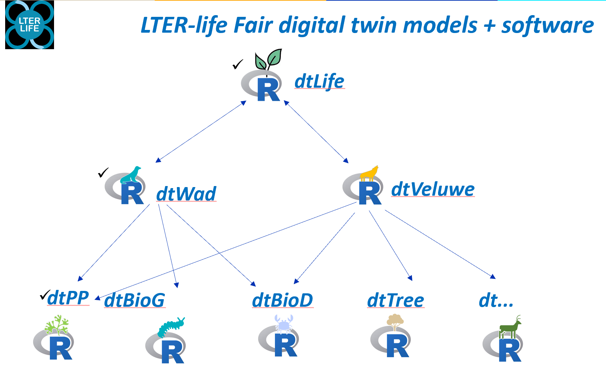

# dtR
R packages for digital twins

<center></center>

**dtR** is a set of R-packages that form the backbone of the modelling and software part of the LTER-life digital twin project. 

To date it contains 3 R-packages:

* *dtLife*, the main LTER-LIFE R-package that contains global functions
* *dtTools*, same as *dtLife* with the intention to replace it. For now, *dtLife* is only supported for backward compatibility of previous protoDT
* *dtWad*, the Waddensea LTER-LIFE R-package with data
* *dtPP*, the LTER-LIFE R-package for estimating photosynthesis


## Installation

Before installing the *dtR* packages, you will need to first install the following R-packages and their dependencies:

* *deSolve*, for the dynamic models developed in dtR;
* *FME*, to fit models to data, for sensitivity analysis, monte carlo simulations;
* *plot3D*, required for simple plotting;
* *sf*, to work with spatial data files; 
* *ncdf4*, for reading net CDF files

It is also handy to have installed:

the packages knitr and rmarkdown

Once the above packages have been installed, type the following command in the R-console to install the *dtLife* package:

```
devtools::install_github("LTER-LIFE/dtR/dtLife", depend=TRUE)
```

*dtTools* is a copy of *dtLife* with functionalities developed to replace *dtLife* in the future. For compatibility reason, we still currently support dtLife. Future development will continue with dtTools. 

```
devtools::install_github("LTER-LIFE/dtR/dtTools", depend=TRUE)
```

after which you can install the *dtWad* package:

```
devtools::install_github("LTER-LIFE/dtR/dtWad", depend=TRUE)
```
and the *dtPP* package:
```
devtools::install_github("LTER-LIFE/dtR/dtPP", depend=TRUE)
```

Then, type ``require(dtLife)`` and ``require(dtTools)``  in the R-console to load the package in R. 

That's it! After this step, you should be able to use the packages.
